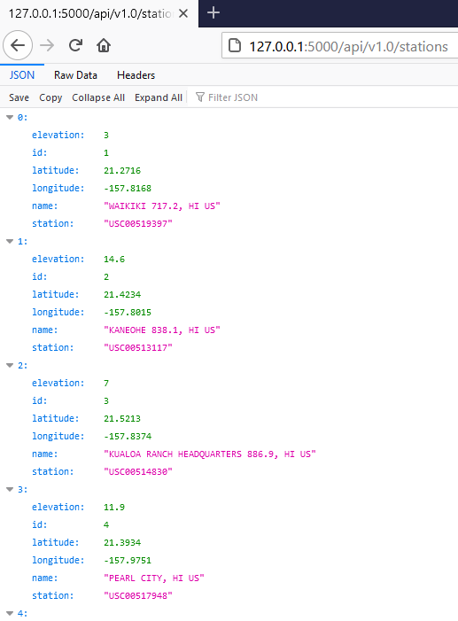

# **SQLAlchemy Challenge - Surfs Up!**

## Background
Congratulations! You've decided to treat yourself to a long holiday vacation in Honolulu, Hawaii! To help with your trip planning, you need to do some climate analysis on the area. The following outlines what you need to do.

## Step 1 - Climate Analysis and Exploration
To begin, use Python and SQLAlchemy to do basic climate analysis and data exploration of your climate database. All of the following analysis should be completed using SQLAlchemy ORM queries, Pandas, and Matplotlib.

* Use the provided [starter notebook](climate_starter.ipynb) and [hawaii.sqlite](Resources/hawaii.sqlite) files to complete your climate analysis and data exploration.

* Choose a start date and end date for your trip. Make sure that your vacation range is approximately 3-15 days total.

* Use SQLAlchemy `create_engine` to connect to your sqlite database.

### Precipitation Analysis

* Design a query to retrieve the last 12 months of precipitation data.

* Select only the `date` and `prcp` values.

* Load the query results into a Pandas DataFrame and set the index to the date column.

* Sort the DataFrame values by `date`.

* Plot the results using the DataFrame `plot` method.

  
  
* Use Pandas to print the summary statistics for the precipitation data.

  
  

### Station Analysis

* Design a query to calculate the total number of stations. **Answer: Total number of stations in the dataset is 9.**

* Design a query to find the most active stations. **Answer: The most active station among the 9 is "USC00519281" with a total observation of 2772.**

* Design a query to retrieve the last 12 months of temperature observation data (TOBS).

  * Filter by the station with the highest number of observations.

  * Plot the results as a histogram with `bins=12`.

    
    

## Step 2 - Climate App

Now that you have completed your initial analysis, design a Flask API based on the queries that you have just developed.

* Use Flask to create your routes.

### Routes

* `/`

  * Home page.

  * List all routes that are available.
  
  
  
  
* `/api/v1.0/precipitation`

  * Convert the query results to a dictionary using `date` as the key and `prcp` as the value.

  * Return the JSON representation of your dictionary.
  
  
  
  
* `/api/v1.0/stations`

  * Return a JSON list of stations from the dataset.
  
  
  
  
* `/api/v1.0/tobs`

  * Query the dates and temperature observations of the most active station for the last year of data.
  
  * Return a JSON list of temperature observations (TOBS) for the previous year.
  
  
  
  
* `/api/v1.0/<start>`

  * Return a JSON list of the minimum temperature, the average temperature, and the max temperature for a given start date.

  * When given the start only, calculate `TMIN`, `TAVG`, and `TMAX` for all dates greater than and equal to the start date.
  
    

* `/api/v1.0/<start>/<end>`

  * Return a JSON list of the minimum temperature, the average temperature, and the max temperature for a given start-end range.  

  * When given the start and the end date, calculate the `TMIN`, `TAVG`, and `TMAX` for dates between the start and end date inclusive.
  
    

### Bonus: Temperature Analysis I

* For the given dataset, average temperatures across all the stations in June and December are 74.94 fahrenheit and 71.04 fahrenheit respectively. That is,  the difference between average temperatures in June versus December is fairly small (approximately a difference of 4 fahrenheit). 

* Since, the average temperatures are compared for two different periods (June versus December), an unpaired t-test has been conducted to check the differences in means. Even though, the size of the difference in means is small (approximately 4 fahrenheit), the t-test suggests that the difference is statistically significant. That is, in Honolulu-Hawaii, average temperature in June tends to be around 75 fahrenheit and average temperature in December tends to be around 71 fahrenheit.  

### Bonus: Temperature Analysis II

* The chosen period of my trip is "2021-01-04" to "2021-01-18". Hence, I used the matching dates of the latest year from the given dataset; i.e., "2017-01-04" to "2017-01-18". Findings suggest that the lowest, average, and highest temperatures during my trip may be 60.0 fahrenheit, 69.26 fahrenheit, and 81.0 fahrenheit respectively.  

* Following plot summarizes the min, avg, and max temperature of this query as a bar chart. Average temperature is the bar height and peak-to-peak (TMAX-TMIN) value is the y error bar (YERR). Here, error = TMAX - TMIN. 

 
 
* Following plot also summarizes the min, avg, and max temperature of this query as a bar chart. Average temperature is the bar height and peak-to-peak (TMAX-TMIN) value is the y error bar (YERR). Here, error = (TMAX-TAVG) - (TAVG-TMIN).

 
 
### Daily Rainfall Average

* Calculate the rainfall per weather station using the previous year's matching dates.

    
  
* Calculate the daily normals for your trip. Normals are the averages for the min, avg, and max temperatures.

    
    
* Use Pandas to plot an area plot (`stacked=False`) for the daily normals of your trip.

    
    
## Technologies for Assignment
* Python
* SQLAlchemy
* From sqlalchemy.ext.automap import automap_base
* From sqlalchemy.orm import Session
* From sqlalchemy import create_engine and func
* Pandas
* Matplotlip
* Numpy & Scipy
* Flask 
* JSON 
* Routes for api
  
  
